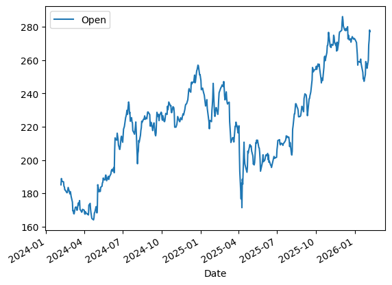
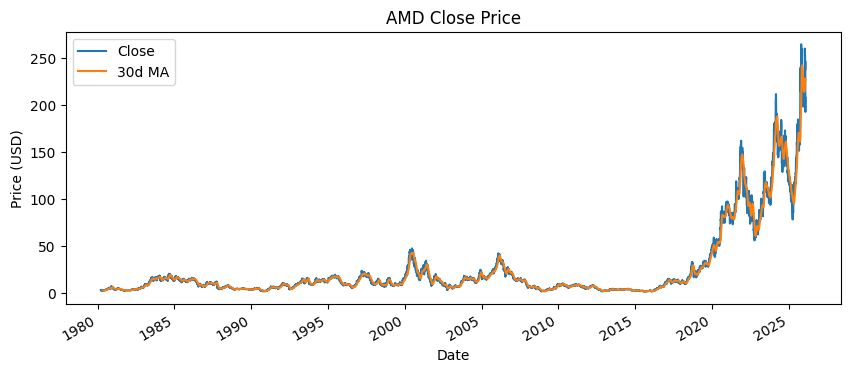
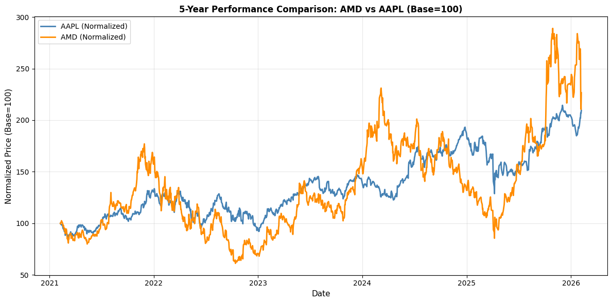

# Stock Market Analysis: AMD vs Apple

This project analyzes and compares stock performance data for AMD (Advanced Micro Devices) and Apple (AAPL) using Python's `yfinance` library and Pandas for data manipulation.

## Project Overview

The assignment involves extracting historical stock data, answering specific questions about AMD, and performing comparative analysis between AMD and Apple stocks.

## Key Findings

### Assignment Questions

1. **AMD Country**: United States
2. **AMD Sector**: Technology
3. **AMD First-Day Trading Volume**: 219,600 shares

### 5-Year Performance Analysis (2021-2026)

- **AMD**: Gained **226.59x** from base of 100
- **AAPL**: Gained **209.47x** from base of 100
- AMD slightly outperformed Apple over the 5-year period

### Daily Returns Correlation (5-Year Period)

- **Correlation Coefficient**: 0.4898 (moderate positive correlation)
- **Sample Size**: 1,255 trading days
- **AMD Average Daily Return**: 0.121%
- **AAPL Average Daily Return**: 0.074%

The scatter plot shows a moderate positive relationship between daily returns, with a linear regression slope of 0.255.

### Rolling 30-Day Correlation Analysis

The correlation between AMD and AAPL returns varies significantly over time:

- **Mean Correlation**: 0.4192
- **Median Correlation**: 0.4060
- **Min Correlation**: -0.2530 (negative correlation periods)
- **Max Correlation**: 0.9213 (strong positive correlation periods)
- **Standard Deviation**: 0.2602

**Key Insights**: The rolling correlation plot reveals dynamic relationships between these stocks:
- 2021: Strong positive correlation (~0.85)
- 2022-2023: Moderate to high correlation (0.4-0.8)
- 2024: Weak to negative correlation (near zero or negative)
- 2025-2026: Variable correlation patterns

## Visualizations

### Plot 1: Apple Opening Price (2-Year Historical)

Historical opening price of Apple stock showing price movements from 2024-2026. The stock showed volatility with a general uptrend after mid-2024.

### Plot 2: Apple Dividends (Historical)

Historical dividend distributions by Apple. The dividend payout has increased over time, particularly accelerating from 2015 onwards, reflecting the company's profitability growth.

### Plot 3: AMD Close Price with 30-Day Moving Average (1980-2026)

Historical AMD closing price spanning 46 years. Key observations:
- Stable/modest price movement (1980-2020)
- Significant growth acceleration starting 2020
- Recent surge in 2024-2025 reaching 250+ USD
- Orange line shows 30-day moving average smoothing the volatility

### Plot 4: 5-Year Normalized Performance Comparison (Base=100)

Direct comparison of AMD and Apple normalized to base value of 100. This visualization controls for different price scales and shows:
- Both stocks trending upward over 5 years
- AMD (orange) showing higher volatility than AAPL (blue)
- AMD reaching 226x while AAPL reaches 209x from base
- Divergence periods where one stock outperforms the other

### Plot 5: 5-Year Daily Returns Correlation Scatter Plot

Scatter plot of daily returns with linear regression fit:
- Each point represents a single trading day
- Positive slope (0.255) indicates that AMD and AAPL tend to move in the same direction
- Moderate spread around the regression line (r=0.490)
- Shows their returns are correlated but with significant variation

### Plot 6: 5-Year Rolling 30-Day Correlation

Shows how the correlation between AMD and AAPL returns evolves over time:
- Shaded blue area indicates positive correlation periods
- Red dashed line marks zero correlation
- Correlation ranges from -0.25 to 0.92
- Reveals that the relationship between these stocks is not static but changes with market conditions

## Data Source

- **Library**: yfinance (Yahoo Finance)
- **Data Type**: Historical OHLCV data (Open, High, Low, Close, Volume)
- **Period Analyzed**: 5-year period for comparative analysis; full history for individual stocks

## Technologies Used

- **Python 3**
- **yfinance**: Stock data extraction
- **Pandas**: Data manipulation and analysis
- **NumPy**: Numerical computations
- **Matplotlib**: Data visualization
- **JSON**: Data storage for company info

## Key Insights

1. **Sector Correlation**: Both companies are in the technology sector, resulting in moderate correlation (0.49) in daily returns
2. **Performance**: AMD has slightly outperformed Apple over the 5-year period (226.59x vs 209.47x)
3. **Volatility**: AMD exhibits higher volatility than Apple, reflected in its more erratic price movements
4. **Temporal Dynamics**: The rolling correlation shows that market conditions and company-specific events create periods of both strong and weak correlation
5. **Diversification**: The moderate correlation (~0.49) suggests these stocks would provide reasonable diversification benefits in a portfolio

## Files

- `Final_Assignment Library.ipynb`: Main analysis notebook containing all code and analysis
- `amd.json`: AMD company information
- `apple.json`: Apple company information
- `images/`: Directory containing extracted visualization plots

## How to Use

1. Install required packages: `pip install yfinance pandas numpy matplotlib`
2. Run the Jupyter notebook to execute the analysis
3. All plots are automatically generated and saved

